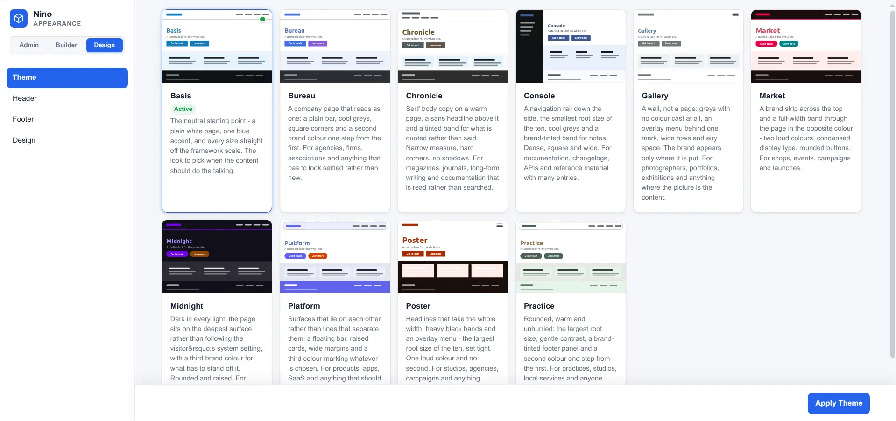
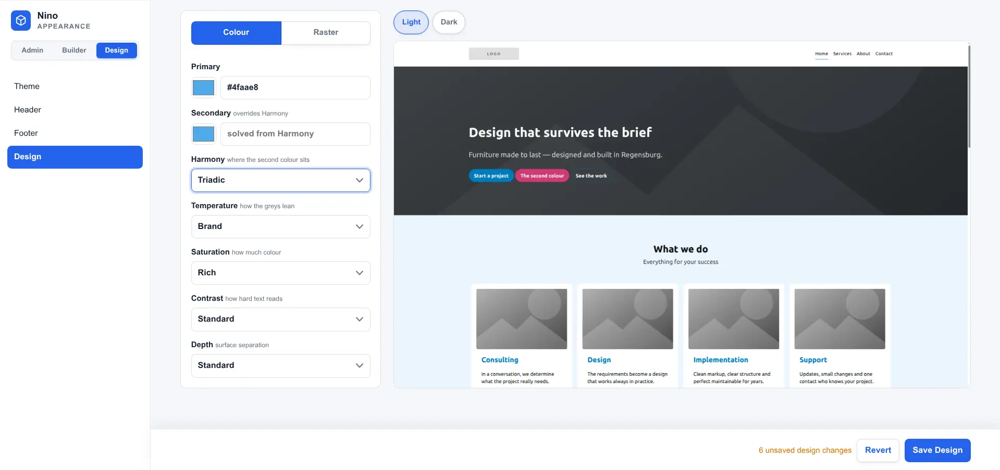

# Das Design-Panel — Referenzhandbuch

**Sprache:** [English](appearance.md) · Deutsch

> **Archiviert.** Dies ist das Handbuch des Panels **Design**, wie Nino 1.1 es ausgeliefert hat – ein Panel, das Nino 1.2 nicht mehr hat, zusammen mit dem Theme-, Header- und Footer-Katalog, der daneben in [`design-library/`](../README.de.md) geparkt liegt. Es bleibt als Referenz für das **Design-Feature**, das noch nicht geschrieben ist: Die Einstellungen unten, die Token-Namen, die sie erzeugen, und die Flächen, die diese Token einfärben, sind der Vertrag, an dem sich dieses Feature messen lassen muss.
>
> Nichts hiervon beschreibt ein Nino, das man heute installieren kann. Ein 1.2-Projekt bekommt ein festes Aussehen – `assets/theme.css`, ausgeliefert von der Base-Einheit des Einrichtungsassistenten – und bearbeitet es von Hand.

<a href="assets/_design1.webp" target="_blank"></a>
<a href="assets/_design2.webp" target="_blank"></a>
<a href="assets/_design3.webp" target="_blank"></a>

**Stand:** 7. September 2026 · **Nino-Version:** 1.0.0-beta

Diese Anleitung erklärt die vier Darstellungseditoren des Panels **Design** der Workbench: Theme, Design, Header und Footer. Der strukturelle Seitenaufbau gehört zum [Template-Baukasten](https://github.com/dapeio/nino-features/blob/main/features/Templates/docs/templates.de.md), einem Feature aus dem Katalog, alles Weitere zur Workbench im [`/_admin`-Handbuch](https://github.com/dapeio/nino/blob/main/docs/_admin.de.md).

**Weiterführende Links:**
[README](https://github.com/dapeio/nino/blob/main/README.de.md) · [Grundkonzepte](https://github.com/dapeio/nino/blob/main/docs/concepts.de.md) · [Entwickler-Handbuch](https://github.com/dapeio/nino/blob/main/docs/development.de.md) · [Rezepte](https://github.com/dapeio/nino/blob/main/docs/recipes/README.md) · [Erste Schritte](https://github.com/dapeio/nino/blob/main/docs/getting-started.de.md) · [Einrichtungsassistent](https://github.com/dapeio/nino/blob/main/docs/setup.de.md) · [`/_admin`-Workbench](https://github.com/dapeio/nino/blob/main/docs/_admin.de.md) · [Design-Panel](appearance.de.md) · [Features](https://github.com/dapeio/nino/blob/main/docs/features.de.md) · [Deployment](https://github.com/dapeio/nino/blob/main/docs/deployment.de.md) · [Security Policy](https://github.com/dapeio/nino/blob/main/SECURITY.md) · [Changelog](https://github.com/dapeio/nino/blob/main/CHANGELOG.md)

**Sicherheit:** Das Panel ist Teil von `/_admin` und verlangt bei jeder Aktion `/_admin/design/manage` – eine Entwicklerberechtigung, nie eine der Redaktion. Es ist das Design-Modul, ein optionales Kernel-Modul (`_nino/Nino/Modules/Design/`), das die Workbench verlässt, wenn es in `/nino/modules` abgeschaltet wird. Das Panel benennt seine Einstellungen in der Oberflächensprache (`_nino/Nino/Modules/Design/text/<locale>.php`); das Schema, aus dem sie stammen, bleibt englisch, weil der Einrichtungsassistent dieselben Einstellungen rendert und kein eigenes Textsystem hat – eine dort ergänzte Einstellung erscheint also in beiden, in den Worten des Schemas, bis ein Fill sie benennt.

## Wofür das Panel da ist

Das Design-Panel hält die vier Darstellungsentscheidungen der Seite bearbeitbar, nachdem der einmalige Assistent entfernt wurde:

- **Theme** wählt einen vollständigen visuellen Ausgangspunkt und installiert sein Stylesheet, seine Schriften sowie die empfohlenen Werte für Design, Header und Footer.
- **Design** ändert ausschließlich die erzeugte Farbpalette und das Größenraster.
- **Header** ändert ausschließlich `templates/theme.header.tpl` und `assets/style.header.css`.
- **Footer** ändert ausschließlich `templates/theme.footer.tpl` und `assets/style.footer.css`.

Das Anwenden eines Themes ist bewusst umfassend: Es setzt die drei folgenden Entscheidungen auf die Empfehlungen des gewählten Manifests zurück. Design, Header und Footer arbeiten dagegen bewusst schmal, sodass das Festlegen eines Bereichs weder das Theme erneut anwendet noch einen der anderen Bereiche verändert.

Der Design-Teil bleibt auf gemessenen Paaren aufgebaut. Ein Stylesheet fragt eine Farbe über ihren Namen an — `var(--nino-alt)` für einen Abschnittshintergrund, `var(--nino-on-alt)` für den Text darauf — und das Modul berechnet den Wert und prüft seinen Kontrast vor dem Schreiben.

## Anmeldung und Oberfläche

Melden Sie sich unter `/_admin` an und öffnen Sie **Design** in der Gruppe Struktur; `#design/header` öffnet den Header-Editor direkt. Die vier Editoren sind Tabs am oberen Rand des Panels. Die feste Aktionsschaltfläche am Fuß wechselt mit dem aktiven Tab zwischen **Apply Theme**, **Save Design**, **Apply Header** und **Apply Footer**. Der Wechsel zu einem anderen Panel behält den Stand des Panels; das Verlassen der Seite mit ungespeicherten Design-Änderungen fragt vorher nach.

Theme zeigt den verfügbaren Katalog als Karten. Header und Footer besitzen jeweils eine Auswahl und ein hohes, gesandboxtes Vorschau-Iframe aus dem echten Frame-Template, dem aktiven Theme und dem gespeicherten Design. Das Iframe ist inert und kann keine Skripte einer Variante ausführen.

Design bietet Primär, optionale Sekundärfarbe, Kontrast, Farben, Volume, Spacing und Shaping. Änderungen werden für die Specimens in der Oberfläche neu berechnet, ohne Projektdateien zu schreiben; **Save Design** übernimmt sie.

## Gemeinsame Darstellungs-Library

Der Assistent und das Panel lesen denselben Katalog:

| Pfad | Vertrag der Einheit |
|---|---|
| `_admin/install/library/themes/<key>/` | `manifest.php`, Vorschau und alle vom Manifest installierten Dateien |
| `_admin/install/library/header/<key>/` | `template.tpl` plus optionale `style.css` |
| `_admin/install/library/footer/<key>/` | `template.tpl` plus optionale `style.css` |

Der Katalog gehört dem Assistenten. Wird `_admin/install/` aus der Auslieferung entfernt — die Empfehlung für den Produktivbetrieb —, können die drei katalogbasierten Tabs keine Varianten mehr auflisten und sagen das auch; der Tab Design arbeitet unverändert weiter, weil er erzeugt statt kopiert. Nur `_admin/install/library/themes/*/preview.svg` ist ein öffentliches Asset. `_admin/install/library/.htaccess` und der Entwicklungsrouter verweigern den direkten Zugriff auf Manifeste, Templates, Stylesheets und Font-Quellen. Die Frame-Vorschauen und die Rahmen um die Beispielseite rendert der Code des Assistenten selbst, bei Bedarf geladen, solange er da ist.

## Die Einstellungen

### Primär und Sekundär

Zwei Hex-Farben. Die Primärfarbe wird zur `brand`-Fläche und färbt die neutralen Grautöne ein — ein zur Markenfarbe hin verschobenes Grau wirkt gewählt und nicht zufällig. Die Sekundärfarbe wird zur `accent`-Fläche. Ohne Sekundärfarbe entsteht der Akzent aus Helligkeit und Chroma der Marke, um den Winkel der Harmonie über den Farbkreis getragen; bei Monochrome landet er wieder auf der Marke selbst, was für ein Ein-Akzent-Design richtig ist.

`brand` und `accent` sind exakt die Farben, die der Picker geliefert hat — Byte für Byte, im hellen wie im dunklen Modus. Nichts verschiebt sie: weder der Sättigungsregler noch der Kontrastlöser noch der Modus. Wer seinen Firmen-Hex eintippt, muss genau diesen Hex im Stylesheet wiederfinden. Der Preis dafür ist, dass sie das einzige Paar ohne garantiertes Kontrastverhältnis sind — genau deshalb stehen `brand-safe` und `accent-safe` daneben. Diese beiden sind dieselbe Farbe, entlang der wahrnehmungsbezogenen Helligkeitsachse verschoben, bis der Text darauf das Kontrastziel erreicht; erkennbar bleiben Farbton und Sättigung. Ein Markenblau kann als `brand-safe` etwas dunkler herauskommen als im Logo; es ist trotzdem dasselbe Blau.

### Kontrast

4,5:1 ist der Boden an jeder Position, gedämpfter Text eingeschlossen. Der Regler entscheidet, wie weit *über* diesem Boden die Schrift sitzt.

| Einstellung | Gelöstes Verhältnis (Links, Markenflächen) | Fließtext-Tinte auf Weiß |
|---|---|---|
| Soft | 4,5:1 | ein weiches Fast-Schwarz, rund 9:1 |
| Default | 4,5:1 | Fast-Schwarz |
| High | 7,0:1 | Schwarz |

Die beiden Spalten bewegen sich aus verschiedenen Gründen. Die gelösten Ziele — `TARGET_TEXT` und `TARGET_MUTED`, an jeder Position derselbe Wert — gelten dort, wo ein Verhältnis erreicht werden muss: bei Links und bei der Helligkeit, auf die eine Markenfläche verschoben wird, damit Text darauf besteht. Fließtext wird überhaupt nicht gegen ein Ziel gelöst, denn das ergäbe graue Schrift auf Weiß bei exakt 4,5:1 — zulässig und sichtbar ausgewaschen. Er ist stattdessen eine Helligkeit, und genau die nimmt eine lesende Person wahr.

Die gedämpfte Stufe durfte früher bis 3,0:1 gehen, was nur für große Schrift ausreicht; ein gedämpfter Absatz ist keine große Schrift und trägt deshalb denselben Boden wie der Fließtext. 4,5:1 ist die WCAG-AA-Anforderung für Fließtext (SC 1.4.3), 7,0:1 entspricht AAA. Rahmen zielen auf 3:1 (SC 1.4.11), und der Fokusring wird bei jeder Einstellung dort gehalten — er ist der eine Wert, den kein Regler aufweichen darf.

### Farben

Skaliert allein die Sättigung: `Clean` dämpft auf 45 %, `Vibrant` verstärkt auf 150 %. Die Helligkeit bleibt beim Kontrast. Dass die beiden Regler auf getrennten Achsen arbeiten, macht sie erst vorhersagbar — sonst würden beide um denselben Wert streiten und keiner täte, was sein Name verspricht.

Die Statusfarben ignorieren diese Einstellung. Rot muss rot bleiben, damit die Markenregler eine Gefahrenfläche nicht in etwas Beruhigendes verwandeln können.

## Das Größenraster

Dieselbe Trennung, auf Größen angewandt: Das Modul veröffentlicht einen festen Satz Stufen, das Theme entscheidet, welche Stufe eine Komponente nutzt. Nummeriert statt benannt, denn eine Größe hat keine eigene Bedeutung — `--nino-space-3` ist eine Stufe, `--nino-alt` eine Fläche.

| Token | Stufen |
|---|---|
| `--nino-text-1` … `--nino-text-6` | die Typo-Skala, von Fließtext bis Display |
| `--nino-space-1` … `--nino-space-6` | die Abstands-Skala |
| `--nino-radius-1` … `--nino-radius-3` | Eckenradien |
| `--nino-radius-full` | eine Pille; bei jeder Einstellung dieselbe Antwort |
| `--nino-line-height` | der vertikale Rhythmus |

Drei Einstellungen formen es.

**Volume** legt fest, wie weit die Typo-Skala auffächert. Sie ist am Fließtext verankert: Stufe 1 bleibt bei jeder Einstellung, bewegt wird das Display-Ende. Eine Skala wird größer, indem sie oben auffächert — nicht, indem sie die Größe mit hochschiebt, die man tatsächlich liest.

**Spacing** skaliert die Abstände und bewegt die Zeilenhöhe mit. Es greift bei den kleinen Stufen am stärksten — die großen sind bereits abschnittsgroß, und sie zu verdoppeln erzeugt nur Scrollweg.

**Shaping** setzt die drei Radien. Absolute Werte statt eines Faktors, denn ein Radius hat einen Boden bei 0 und eine Decke bei der halben Box, an der ein Faktor vorbeischießen würde.

Der Standardwert jeder Einstellung reproduziert exakt die Skala von `Nino.css`. Das Einschalten der Design-Ebene darf ein Projekt nicht bewegen, das nichts verlangt hat.

`--nino-text-4` bis `--nino-text-6` wachsen bei 768px erneut, in einer eigenen Media Query des Rasters — am selben Breakpoint, den `Nino.css` bereits nutzt. Das Raster hat keine Hell/Dunkel-Variante und wird deshalb, anders als die Palette, nur einmal geschrieben.

## Die Flächen

Eine Fläche ist ein Hintergrund samt allem, was darauf lesbar ist. Es gibt zwölf, in der Reihenfolge, die `Tokens::SURFACES` nennt:

| Fläche | Verwendung |
|---|---|
| `default` | der Seitengrund |
| `alt` | ein kaum wahrnehmbarer Schritt davon weg, für abwechselnde Abschnitte |
| `tint` | der fünfte Grund: der Seitengrund, der den Markenton trägt statt eines Fast-Graus |
| `dark` | ein bewusst dunkler Block; in hellem und dunklem Modus gleich |
| `black` | die tiefste Stufe, für Footer und schwere Abschnitte |
| `brand` | die Primärfarbe exakt wie gewählt; es wird nie darauf geschrieben |
| `brand-safe` | dieselbe Farbe, in der Helligkeit gelöst, bis Text darauf besteht |
| `accent` | die zweite Farbe exakt wie gewählt oder abgeleitet |
| `accent-safe` | dieselbe Farbe, auf demselben Weg sicher gemacht |
| `success`, `warning`, `danger` | Status, mit festen Farbtönen |

Die Marke besteht aus vier Rollen statt aus zwei. Jede beantwortet eine von zwei Fragen: Ist es die Marke oder die zweite Farbe, und ist es die gewählte oder die, auf der Text besteht? Mit zwei Rollen brach das Modell, sobald eine Sekundärfarbe gesetzt war: Die sichere Fläche wurde zum sicher gemachten *Akzent*, und in der Palette blieb keine kontrastsichere Markenfarbe übrig.

Jede veröffentlicht zehn Werte:

| Token | Bedeutung |
|---|---|
| `--nino-<fläche>` | der Hintergrund |
| `--nino-on-<fläche>` | Fließtext darauf |
| `--nino-on-<fläche>-muted` | Sekundärtext darauf |
| `--nino-<fläche>-link` | Linkfarbe darauf |
| `--nino-<fläche>-border` | ein Rahmen dagegen, mit 3:1 |
| `--nino-<fläche>-focus` | der Fokusring, mit 3:1 |
| `--nino-<fläche>-hover` | der Hintergrund eine Interaktionsstufe höher |
| `--nino-<fläche>-active` | der Hintergrund im gedrückten Zustand |
| `--nino-<fläche>-disabled` | Text, der bewusst nicht lesbar ist |
| `--nino-<fläche>-shadow` | ein Schatten, der auf diesem Grund funktioniert |

Sprechen Sie eine Fläche an, nie eine Rampenstufe. `var(--nino-alt)` sagt, was gemeint ist; eine Nummer sagt nur, an welcher Stelle einer Liste sie steht, die neu nummeriert werden kann.

## Hell und Dunkel

Die Datei wird dreimal geschrieben: einmal für Hell, einmal innerhalb von `@media (prefers-color-scheme: dark)` und einmal für `:root[data-nino-mode="dark"]`. Der Media-Block ist so abgesichert, dass eine ausdrückliche Hell-Wahl die Systemeinstellung schlägt, und der Attribut-Block steht zuletzt, damit eine ausdrückliche Dunkel-Wahl alles andere schlägt.

Praktisch bedeutet das: derselbe Token-Name liefert in allen drei Zuständen den richtigen Wert — System hell, System dunkel und manuelle Übersteuerung in beide Richtungen.

## Wo die Datei landet

**Save Design** schreibt `/assets/style.design.css` und setzt sie im CSS-Bundle unmittelbar hinter `_nino/Nino.css`:

```
_nino/Nino.css            Framework
assets/style.design.css   ← hier erzeugt
assets/style.theme.*.css  das Theme
assets/style.header.css   der gewählte Header-Frame
assets/style.footer.css   der gewählte Footer-Frame
assets/style.css          eigene Übersteuerungen
```

Die Reihenfolge ist die Regel, die das Ganze trägt: Design liefert die Werte, das Theme entscheidet, was damit geschieht, Ihr eigenes Stylesheet hat das letzte Wort. Was später in der Liste steht, übersteuert alles Frühere.

**Bearbeiten Sie `style.design.css` nicht.** Jedes Speichern schreibt die Datei vollständig neu. Eigene Änderungen gehören in `assets/style.css`, die nie angefasst wird.

## Woher die Einstellungen kommen

Der Theme-Schritt des Assistenten oder der Theme-Tab des Panels schreibt zuerst den Ausgangspunkt aus dem `design`-Block, mit dem das gewählte Theme gezeichnet wurde. Der unabhängige Design-Tab speichert danach die Auswahl der Bedienung. Alle Wege verwenden dasselbe `\Nino\Modules\Design::write()` - also einen Generator und ein Stylesheet, nicht getrennte Installations- und Laufzeitkopien.

## Die Darstellung später ändern

Das Panel bleibt nach der Installation verfügbar. Ein laufendes Projekt umzufärben heißt, Design zu ändern und zu speichern; ein anderer Header oder Footer kopiert nur die beiden Dateien dieses Frames. Keine dieser Änderungen benötigt eine Neuinstallation oder Inhaltsmigration.

Ein anderes Theme anzuwenden ist der bewusste Reset. Dabei werden die vom neuen Manifest benannten Dateien überschrieben, das Theme-Stylesheet im Bundle ersetzt und die empfohlenen Design- und Frame-Werte geschrieben. Dateien, die nur ein vorheriges Theme mitgebracht hat, bleiben bestehen. Sichern Sie projektspezifische Änderungen in Git, bevor Sie ein Theme erneut anwenden.

## Fehlerbehebung

| Symptom | Ursache und Abhilfe |
|---|---|
| Farben ändern sich nach dem Speichern nicht | Browser-Cache. Mit Cache-Umgehung neu laden; das Bundle wird beim Schreiben neu erzeugt. |
| Die Markenfarbe wirkt als Fläche anders | So gewollt bei `brand-safe`, wo die Helligkeit bis zum Kontrastziel verschoben wurde; Farbton und Sättigung bleiben erhalten. `brand` selbst wird nie verschoben. |
| Sekundäre Elemente sehen aus wie primäre | Keine Sekundärfarbe gesetzt und Harmonie auf Monochrome — der abgeleitete Akzent landet auf der Marke. Eine Sekundärfarbe setzen oder eine andere Harmonie wählen. |
| `style.design.css` verliert manuelle Änderungen | Die Datei wird erzeugt. Nutzen Sie `assets/style.css`. |
| Theme, Header oder Footer meldet, dass keine Varianten verfügbar sind | `_admin/install/` wurde entfernt oder sein Katalog ist unvollständig. Das ist nach dem empfohlenen Deployment der Normalfall. Zum Umschalten `_admin/install/` aus derselben Nino-Version gesperrt wieder ausliefern. |
| Eine Frame-Vorschau unterscheidet sich von der Live-Seite | Die Vorschau nutzt vorhandene installierte Includes und Texte, bleibt aber ein inertes Einzel-Frame-Dokument. Für Request-abhängige Modulausgabe das angewendete Template auf der vollständigen Seite prüfen. |
| Nach dem Laden der Regler erscheint `(403) Request failed.` | Entweder fehlt dem Konto `/_admin/design/manage`, oder der CSRF-Token der Seite ist nach Anmeldung, Abmeldung, Sitzungswechsel oder Deployment veraltet. `/_admin` neu laden; falls nötig erneut anmelden. |
| Das Panel fehlt in der Navigation | Dem Konto fehlt `/_admin/design/manage`, oder das Design-Modul steht nicht in `/nino/modules`. |

## Katalogvertrag

Alle zehn mitgelieferten Themes — Basis, Bureau, Chronicle, Console, Gallery, Market, Midnight, Platform, Poster und Practice — sind Abbildungsschichten. Jede Farbrolle liest ein erzeugtes `--nino-*`-Token, jede Größenrolle das erzeugte Raster, und jedes Manifest erklärt die vollständige Design- und Frame-Ausgangslage seiner Vorschau. Ein eigenes Katalog-Theme muss diesen Vertrag einhalten, damit die Design-Regler es zuverlässig umfärben und umformen können.

## Nächste Schritte

- Der **Template-Baukasten** – Seitentemplates aus ganzen Abschnitten – ist ein Feature aus dem Katalog [dapeio/nino-features](https://github.com/dapeio/nino-features); sein [Handbuch](https://github.com/dapeio/nino-features/blob/main/features/Templates/docs/templates.de.md) liegt dort ebenfalls.
- [`/_admin`-Workbench](https://github.com/dapeio/nino/blob/main/docs/_admin.de.md) beschreibt den Rest der Workbench, zu der dieses Panel gehört.
- [Entwickler-Handbuch](https://github.com/dapeio/nino/blob/main/docs/development.de.md) dokumentiert den Token-Vertrag für Stylesheet-Autoren.
